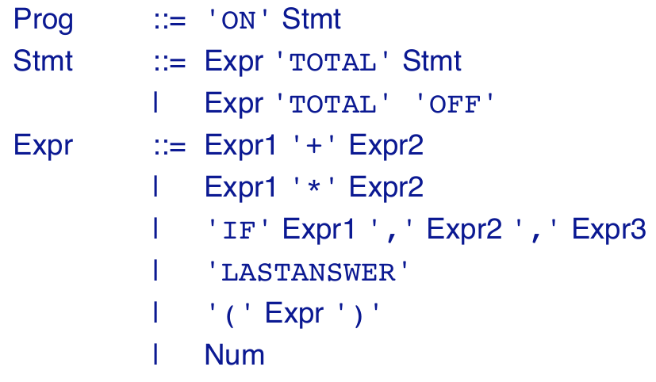

---
title:  'Programming languages - U7'
author:
- Jan Dietrich - 10-100-436
keywords: [Programming, languages]
description: |
    programming
    languages
...


# 1

Existing syntax



We need 3 new lines in abstract syntax above
Additionally to the two existing operators +, * we add

```
| Expr1 '-' Expr2
| Expr1 '/' Expr2
```


For the division with zero we add to the expression

```
| 'NaN'
```

The semantics also needs some changes

1. The output of the Programm changes 
2. The semantics for '-', '/' need to be added
    - the '/' semantics needs to have a case distinction (divisor 0 or not 0)

Program $\rightarrow$ Int* $\lor$ String

S: ExprSequence $\rightarrow$ Int $\rightarrow$ Int* $\lor$ String

```
E[[ E1 - E2 ]] (n) = E[[ E1 ]] (n) - E[[ E2 ]] (n)
```

```
E[[ E1 / E2 ]] (n) = if E[[ E1 ]] (n) = 0
                     then E [[ NaN ]] (n)
                     else E[[ E1 ]] (n) / E[[ E2 ]] (n)
```
```
E[[ NaN ]] (n) = 'NOT A NUMBER'
```


# 2

```
Number = Number BooleanDigit | BooleanDigit
```

## semantic

every digit (from right to left) must be multiplied by 1, 2, 4, 8 so we have to add $2 *$ to every digit

E: Number $\rightarrow$ NaturalNumber

```
E[[ Number BooleanDigit ]] = 2 * E[[ Number ]] + E[[ BooleanDigit ]]
E[[ 0 ]] = 0
E[[ 1 ]] = 1
```

To verify we evaluate `E[[ '10101' ]]`

```
E[[ '10101' ]] = 2 * E[[ '1010' ]] + E [[1]]
               = 2 * (2 * E[[ '101' ]] + E[[0]]) + E[[1]]
               = 2 * (2 * (2 * E[[ '10' ]] + E[[1]] ) + E[[0]]) + E[[1]]
               = 2 * (2 * (2 * (2 * E[[1]] + E[[0]]) + E[[1]] ) + E[[0]]) + E[[1]]
               = 2 * (2 * (2 * (2 * 1 + 0) + 1 ) + 0) + 1
               = 2 * (2 * (2 * 2 + 1 ) + 0) + 1
               = 2 * (2 * 5 + 0) + 1
               = 2 * 10 + 1
               = 21
```
